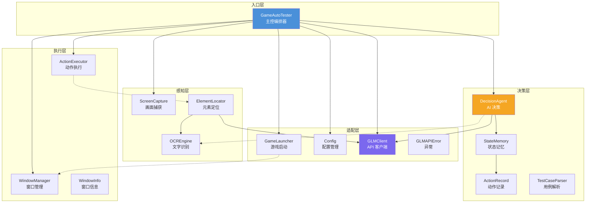
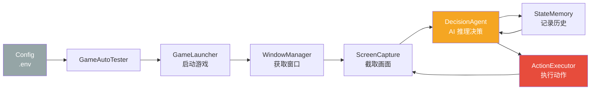

# 架构文档

## 项目概述

Game Auto Test 是一个基于 GLM 多模态大模型的 AI 驱动 Windows 游戏自动化测试框架。框架通过截取游戏画面，利用 GLM-4V 视觉模型进行场景理解和推理决策，自动生成并执行操作动作（点击、输入、按键等），从而实现无需预先编写脚本的智能游戏测试。

### 核心能力

- **ReAct 推理循环**：每一步都经过"观察-推理-行动"的完整思考链
- **多策略元素定位**：OCR 文本定位 + GLM 视觉定位 + 模板匹配 + 颜色匹配
- **历史上下文感知**：决策时参考完整动作历史，避免重复失败
- **自动错误恢复**：连续失败检测与策略切换

---

## 架构模式

### 1. ReAct（Reasoning + Acting）模式

框架的核心决策循环采用 ReAct 模式，每个步骤包含三个阶段：

```
观察(Observe) -> 推理(Reason) -> 行动(Act)
     ^                                |
     |                                v
     +----------- 反馈(Feedback) <----+
```

- **观察**：`ScreenCapture` 截取当前画面，`OCREngine` 提取文本信息
- **推理**：`DecisionAgent` 将画面 + 历史上下文发送给 GLM，获取结构化 JSON 决策
- **行动**：`ActionExecutor` 执行具体操作（click / type / keypress / wait / assert / done）
- **反馈**：`StateMemory` 记录执行结果，注入下一轮推理上下文

### 2. 分层架构

系统按职责划分为 5 个层次，自上而下依次调用：

| 层次 | 模块 | 职责 |
|------|------|------|
| 入口层 | `main.GameAutoTester` | 主控编排，组合所有模块，驱动 ReAct 主循环 |
| 决策层 | `agents.DecisionAgent` | AI 决策与 ReAct 推理，Prompt 构建，响应解析 |
| 感知层 | `vision.ScreenCapture` / `OCREngine` / `ElementLocator` | 画面捕获、文字识别、元素定位 |
| 执行层 | `action.ActionExecutor` / `WindowManager` | 输入模拟（pydirectinput）、窗口管理（win32gui） |
| 适配层 | `game.GameLauncher` / `utils.Config` / `utils.GLMClient` | 游戏进程管理、配置加载、API 通信 |

### 3. 依赖注入（DI）

所有模块间的依赖通过构造函数参数注入，而非内部创建：

- `DecisionAgent` 注入 `GLMClient`、`StateMemory`，运行时注入 `OCREngine`
- `ElementLocator` 注入 `OCREngine`、`GLMClient`
- `ActionExecutor` 参数注入 `ElementLocator`（在 `click` / `type_text` 方法中传入）
- `GameAutoTester` 作为编排器，负责创建并注入所有依赖

```
GameAutoTester
  |-- GLMClient（创建）
  |-- StateMemory（创建）
  |-- OCREngine（创建）
  |-- ElementLocator <-- 注入 OCREngine, GLMClient
  |-- DecisionAgent  <-- 注入 GLMClient, StateMemory
  |-- ActionExecutor <-- 运行时传入 ElementLocator
```

### 4. 适配器（Adapter）模式

对外部依赖的封装采用适配器模式，将第三方 API 统一为本框架的接口：

| 外部依赖 | 适配器 | 封装内容 |
|----------|--------|----------|
| GLM-4V API | `GLMClient` | HTTP 请求、base64 编码、重试策略、会话管理 |
| EasyOCR | `OCREngine` | 懒加载、图像格式转换、文本搜索与定位 |
| mss | `ScreenCapture` | 截图区域控制、窗口坐标转换、文件保存 |
| pydirectinput | `ActionExecutor` | 坐标转换、动作编排、延迟控制 |
| win32gui | `WindowManager` | 窗口枚举、进程关联、窗口激活 |

---

## 模块总览

| 模块 | 文件路径 | 核心类 | 职责 |
|------|----------|--------|------|
| 主控 | `src/main.py` | `GameAutoTester` | 编排初始化、ReAct 主循环、动作分发、资源清理 |
| 决策 | `src/agents/decision_agent.py` | `DecisionAgent` | ReAct Prompt 构建、GLM 调用、JSON 响应解析、动作验证 |
| 记忆 | `src/agents/state_memory.py` | `ActionRecord`, `StateMemory` | 动作历史管理、测试生命周期、摘要生成、JSON 序列化 |
| 用例 | `src/agents/test_case_parser.py` | `TestCaseParser` | 自然语言测试用例解析、步骤提取、验证条件提取 |
| 截图 | `src/vision/screen_capture.py` | `ScreenCapture` | mss 截图、区域裁剪、窗口坐标适配、文件保存 |
| OCR | `src/vision/ocr_engine.py` | `OCREngine` | EasyOCR 懒加载、文本识别与搜索、坐标定位 |
| 定位 | `src/vision/element_locator.py` | `ElementLocator` | 文本定位、模板匹配、颜色匹配、GLM 视觉定位 |
| 执行 | `src/action/input_executor.py` | `ActionExecutor` | 鼠标/键盘操作、坐标转换、拖拽、滚动 |
| 窗口 | `src/action/window_manager.py` | `WindowInfo`, `WindowManager` | 窗口查找（标题/PID/进程名）、窗口激活、等待窗口 |
| 启动 | `src/game/game_launcher.py` | `GameLauncher` | 游戏进程启动、关闭、重启、状态检查 |
| 配置 | `src/utils/config.py` | `Config` | dotenv 环境变量加载、配置验证 |
| API | `src/utils/glm_client.py` | `GLMClient`, `GLMAPIError` | GLM API HTTP 调用、图像编码、重试策略 |

---

## 组件图



---

## 数据流

### 主循环数据流



### 单步数据流（一次 ReAct 迭代）

```
1. ScreenCapture.capture()           --> PIL.Image（当前截图）
2. OCREngine.get_all_text_with_positions() --> 文本列表（可选）
3. StateMemory.get_recent_actions()  --> ActionRecord[]（最近 N 条历史）
4. DecisionAgent.decide(image, ocr)  --> {"reasoning": "...", "action": {...}}
5. GameAutoTester.execute_action()   --> bool（成功/失败）
6. StateMemory.add_action(...)       --> 更新动作历史
7. ScreenCapture.capture_and_save()  --> 保存截图（可选）
```

---

## 设计决策

### 为什么选择 ReAct 而非纯 Reflex？

游戏测试场景具有高度不确定性（加载延迟、弹窗、网络波动），纯反射式（输入-输出映射）难以覆盖所有异常路径。ReAct 模式让 AI 在每一步都进行显式推理，能够：

- 根据历史失败调整策略
- 处理意料之外的界面状态
- 在合适时机主动结束测试

### 为什么使用 GLM-4V 而非纯 OCR？

OCR 只能识别画面中的文字，无法理解按钮布局、图标含义、界面状态等视觉信息。GLM-4V 作为多模态模型，能够同时理解文字和图像语义，提供更准确的决策依据。框架采用 OCR + GLM 双通道策略，OCR 负责精确文本定位，GLM 负责全局理解。

### 为什么使用 pydirectinput 而非 pyautogui？

`pydirectinput` 使用 DirectInput 发送硬件级输入事件，能够穿透游戏反作弊机制，兼容大多数 DirectX 游戏。`pyautogui` 使用更高层的 Windows API，部分游戏会忽略其输入。

### 为什么采用懒加载 OCREngine？

EasyOCR 首次加载模型需要 10-30 秒，且占用大量内存。通过 `@property` 懒加载，仅在首次使用时初始化，避免在 OCR 被禁用时浪费资源。

### 为什么依赖注入而非硬编码依赖？

依赖注入使各模块可以独立测试和替换。例如：
- 测试 `DecisionAgent` 时可注入 Mock `GLMClient`
- 测试 `ActionExecutor` 时可注入 Mock `ElementLocator`
- 未来可替换为其他多模态模型而无需修改决策逻辑
