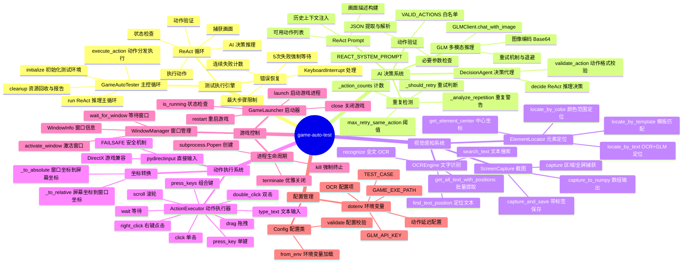

# game-auto-test 业务逻辑脑图

```mermaid
mindmap
  root((game-auto-test))
    测试执行引擎
      GameAutoTester 主控循环
        initialize 初始化测试环境
        run ReAct 推理主循环
        execute_action 动作分发执行
        cleanup 资源回收与报告
      ReAct 循环
        捕获画面
        AI 决策推理
        动作验证
        执行动作
        状态检查
      错误恢复
        连续失败计数
        5次失败强制等待
        最大步骤限制
        KeyboardInterrupt 处理
    AI 决策系统
      DecisionAgent 决策代理
        decide ReAct 推理决策
        validate_action 动作格式校验
      GLM 多模态推理
        GLMClient.chat_with_image
        图像编码 Base64
        重试机制与退避
      ReAct Prompt
        REACT_SYSTEM_PROMPT
        历史上下文注入
        画面描述构建
        可用动作列表
      动作验证
        VALID_ACTIONS 白名单
        必要参数检查
        JSON 提取与解析
      重复检测
        _action_counts 计数
        _should_retry 重试判断
        _analyze_repetition 重复警告
        max_retry_same_action 阈值
    视觉感知系统
      ScreenCapture 截图
        capture 区域/全屏捕获
        capture_and_save 带标签保存
        capture_to_numpy 数组输出
      OCREngine 文字识别
        recognize 全文 OCR
        search_text 文本搜索
        find_text_position 定位文本
        get_all_text_with_positions 批量提取
      ElementLocator 元素定位
        locate_by_text OCR+GLM 定位
        locate_by_template 模板匹配
        locate_by_color 颜色范围定位
        get_element_center 中心坐标
    动作执行系统
      ActionExecutor 动作执行器
        click 单击
        double_click 双击
        right_click 右键点击
        type_text 文本输入
        press_key 单键
        press_keys 组合键
        scroll 滚轮
        drag 拖拽
        wait 等待
      坐标转换
        _to_absolute 窗口坐标到屏幕坐标
        _to_relative 屏幕坐标到窗口坐标
      pydirectinput 直接输入
        FAILSAFE 安全机制
        DirectX 游戏兼容
    游戏控制
      GameLauncher 启动器
        launch 启动游戏进程
        close 关闭游戏
        restart 重启游戏
        is_running 状态检查
      WindowManager 窗口管理
        wait_for_window 等待窗口
        activate_window 激活窗口
        WindowInfo 窗口信息
      进程生命周期
        subprocess.Popen 创建
        terminate 优雅关闭
        kill 强制终止
    配置管理
      Config 配置类
        from_env 环境变量加载
        validate 配置校验
      dotenv 环境变量
        GLM_API_KEY
        GAME_EXE_PATH
        TEST_CASE
        OCR 配置项
        动作延迟配置
```
