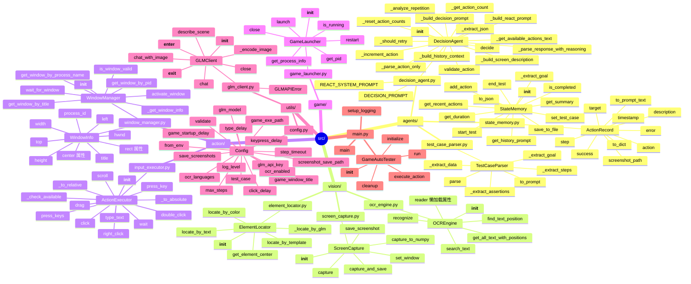

# game-auto-test 模块结构脑图

```mermaid
mindmap
  root((src/))
    agents/
      decision_agent.py
        DecisionAgent
          __init__
          decide
          validate_action
          _build_react_prompt
          _build_decision_prompt
          _build_history_context
          _build_screen_description
          _analyze_repetition
          _should_retry
          _increment_action
          _get_action_count
          _reset_action_counts
          _parse_response_with_reasoning
          _extract_json
          _parse_action_only
          _get_available_actions_text
        REACT_SYSTEM_PROMPT
        DECISION_PROMPT
      state_memory.py
        ActionRecord
          step
          action
          target
          description
          timestamp
          success
          error
          screenshot_path
          to_dict
          to_prompt_text
        StateMemory
          __init__
          set_test_case
          add_action
          get_recent_actions
          get_history_prompt
          start_test
          end_test
          get_duration
          is_completed
          get_summary
          to_json
          save_to_file
          _extract_goal
      test_case_parser.py
        TestCaseParser
          parse
          to_prompt
          _extract_goal
          _extract_steps
          _extract_assertions
          _extract_data
    vision/
      screen_capture.py
        ScreenCapture
          __init__
          set_window
          capture
          capture_to_numpy
          save_screenshot
          capture_and_save
      ocr_engine.py
        OCREngine
          __init__
          reader 懒加载属性
          recognize
          search_text
          find_text_position
          get_all_text_with_positions
      element_locator.py
        ElementLocator
          __init__
          locate_by_text
          locate_by_template
          locate_by_color
          get_element_center
          _locate_by_glm
    action/
      input_executor.py
        ActionExecutor
          __init__
          click
          double_click
          right_click
          type_text
          press_key
          press_keys
          scroll
          drag
          wait
          _to_absolute
          _to_relative
          _check_available
      window_manager.py
        WindowInfo
          hwnd
          title
          left
          top
          width
          height
          process_id
          center 属性
          rect 属性
        WindowManager
          __init__
          get_window_by_title
          get_window_by_process_name
          get_window_by_pid
          activate_window
          wait_for_window
          is_window_valid
          _get_window_info
    game/
      game_launcher.py
        GameLauncher
          __init__
          launch
          is_running
          close
          restart
          get_pid
          get_process_info
    utils/
      config.py
        Config
          glm_api_key
          glm_model
          game_exe_path
          game_window_title
          game_startup_delay
          test_case
          max_steps
          step_timeout
          log_level
          screenshot_save_path
          save_screenshots
          ocr_enabled
          ocr_languages
          click_delay
          type_delay
          keypress_delay
          from_env
          validate
      glm_client.py
        GLMAPIError
        GLMClient
          __init__
          chat
          chat_with_image
          describe_scene
          close
          __enter__
          __exit__
          _encode_image
    main.py
      GameAutoTester
        __init__
        initialize
        execute_action
        run
        cleanup
      setup_logging
      main
```
