# 类图

## 完整类图

按命名空间分组的 Mermaid classDiagram，包含框架中全部 15 个类。

```mermaid
classDiagram
    direction TB

    namespace Main {
        class GameAutoTester {
            -config: Config
            -logger: Logger
            +glm_client: GLMClient
            +game_launcher: GameLauncher
            +window_manager: WindowManager
            +screen_capture: ScreenCapture
            +ocr_engine: OCREngine|None
            +element_locator: ElementLocator
            +action_executor: ActionExecutor
            +state_memory: StateMemory
            +decision_agent: DecisionAgent
            +window_info: WindowInfo|None
            +running: bool
            +__init__(config: Config)
            +initialize() void
            +execute_action(action: dict) bool
            +run() void
            +cleanup() void
        }
    }

    namespace Agents {
        class DecisionAgent {
            -VALID_ACTIONS: list~str~
            +glm_client: GLMClient
            +test_case: str
            +state_memory: StateMemory
            +temperature: float
            +use_react: bool
            +max_retry_same_action: int
            -_action_counts: Dict~str,int~
            +__init__(glm_client, test_case, state_memory, temperature, use_react, max_retry_same_action)
            -_reset_action_counts() void
            -_increment_action(action_type: str, target: str) void
            -_get_action_count(action_type: str, target: str) int
            -_should_retry(action: Dict) bool
            -_build_history_context(recent_only: bool) str
            -_build_screen_description(screenshot: Image, ocr_engine) str
            -_analyze_repetition(action: Dict) str|None
            +decide(image: Image, scene_description: str, ocr_engine) Dict
            -_build_react_prompt(history_context: str, screen_description: str) str
            -_build_decision_prompt(history_context: str) str
            -_get_available_actions_text() str
            -_parse_response_with_reasoning(response: str) Dict
            -_extract_json(text: str) Dict|None
            -_parse_action_only(text: str) Dict
            +validate_action(action: Dict) bool
        }

        class ActionRecord {
            +step: int
            +action: str
            +target: str
            +description: str
            +timestamp: float
            +success: bool
            +error: str|None
            +screenshot_path: str|None
            +to_dict() Dict
            +to_prompt_text() str
        }

        class StateMemory {
            +max_history: int
            +actions: List~ActionRecord~
            +test_case: str
            +test_goal: str
            +start_time: float|None
            +end_time: float|None
            +__init__(max_history: int)
            +set_test_case(test_case: str) void
            -_extract_goal(test_case: str) str
            +add_action(action: str, target: str, description: str, success: bool, error: str|None) void
            +get_recent_actions(n: int) List~ActionRecord~
            +get_history_prompt(n: int) str
            +start_test() void
            +end_test(success: bool) void
            +get_duration() float|None
            +is_completed() bool
            +get_summary() Dict
            +to_json() str
            +save_to_file(filepath: str) void
        }

        class TestCaseParser {
            +parse(test_case: str)$ Dict
            -_extract_goal(test_case: str)$ str
            -_extract_steps(test_case: str)$ List~Dict~
            -_extract_assertions(test_case: str)$ List~str~
            -_extract_data(test_case: str)$ Dict
            +to_prompt(test_case_parsed: Dict)$ str
        }
    }

    namespace Vision {
        class ScreenCapture {
            +window_info: WindowInfo|None
            +save_path: Path
            -_sct: mss
            +__init__(window_info, save_path: str)
            +set_window(window_info) void
            +capture(region: Tuple) Image
            +capture_to_numpy(region: Tuple) ndarray
            +save_screenshot(filename: str, region: Tuple) str
            +capture_and_save(step: int, action: str, region: Tuple) str
        }

        class OCREngine {
            +languages: List~str~
            +use_gpu: bool
            -_reader: easyocr.Reader|None
            +__init__(languages: List~str~, use_gpu: bool)
            +reader: easyocr.Reader
            +recognize(image: Image, detail: int) List
            +search_text(image: Image, search_term: str, confidence_threshold: float) List~Dict~
            +find_text_position(image: Image, search_term: str, confidence_threshold: float) Tuple|None
            +get_all_text_with_positions(image: Image, confidence_threshold: float) List~Dict~
        }

        class ElementLocator {
            +ocr_engine: OCREngine|None
            +glm_client: GLMClient|None
            +window_info: WindowInfo|None
            +__init__(ocr_engine, glm_client, window_info)
            +locate_by_text(image: Image, description: str, confidence_threshold: float) Tuple|None
            +locate_by_template(image: Image, template_path: str, threshold: float) Tuple|None
            +locate_by_color(image: Image, color_range: Tuple, min_area: int) List~Tuple~
            +get_element_center(image: Image, description: str) Tuple|None
            -_locate_by_glm(image: Image, description: str) Tuple|None
        }
    }

    namespace Action {
        class ActionExecutor {
            +window_info: WindowInfo|None
            +click_delay: float
            +type_delay: float
            +keypress_delay: float
            +__init__(window_info, click_delay: float, type_delay: float, keypress_delay: float)
            -_to_absolute(x: int, y: int) Tuple
            -_to_relative(x: int, y: int) Tuple
            -_check_available() void
            +click(target, image, locator, button: str) bool
            +double_click(target, image, locator) bool
            +right_click(target, image, locator) bool
            +type_text(text: str, target, image, locator, clear_first: bool) bool
            +press_key(key: str) bool
            +press_keys(keys: list) bool
            +wait(seconds: float) bool
            +scroll(clicks: int, x: int, y: int) bool
            +drag(start: Tuple, end: Tuple, duration: float) bool
        }

        class WindowInfo {
            +hwnd: int
            +title: str
            +left: int
            +top: int
            +width: int
            +height: int
            +process_id: int
            +center: Tuple~int,int~
            +rect: Tuple~int,int,int,int~
        }

        class WindowManager {
            -_hwnd: int|None
            +__init__()
            +get_window_by_title(title: str) WindowInfo|None
            +get_window_by_process_name(process_name: str) WindowInfo|None
            +get_window_by_pid(pid: int) WindowInfo|None
            -_get_window_info(hwnd: int) WindowInfo
            +activate_window(hwnd: int) bool
            +wait_for_window(process: Popen, timeout: int, title: str) WindowInfo|None
            +is_window_valid(hwnd: int) bool
        }
    }

    namespace Game {
        class GameLauncher {
            +exe_path: Path
            +window_title: str|None
            +startup_delay: int
            +process: Popen|None
            +__init__(exe_path: str, window_title: str, startup_delay: int)
            +launch(args: list, cwd: str) Popen
            +is_running() bool
            +close(force: bool) bool
            +restart() Popen
            +get_pid() int|None
            +get_process_info() dict
        }
    }

    namespace Utils {
        class Config {
            +glm_api_key: str
            +glm_model: str
            +game_exe_path: str
            +game_window_title: str|None
            +game_startup_delay: int
            +test_case: str
            +max_steps: int
            +step_timeout: int
            +log_level: str
            +screenshot_save_path: str
            +save_screenshots: bool
            +ocr_enabled: bool
            +ocr_languages: list
            +click_delay: float
            +type_delay: float
            +keypress_delay: float
            +from_env(env_path: str)$ Config
            +validate() bool
        }

        class GLMClient {
            +api_key: str
            +model: str
            +base_url: str
            +timeout: int
            +url: str
            +session: requests.Session
            +headers: Dict
            +__init__(api_key: str, model: str, base_url: str, max_retries: int, backoff_factor: float, timeout: int)
            -_encode_image(image: Image) str
            +chat(messages: List, temperature: float, max_tokens: int) str
            +chat_with_image(prompt: str, image: Image, history: List, system_prompt: str) str
            +describe_scene(image: Image, context: str) str
            +close() void
            +__enter__() GLMClient
            +__exit__() void
        }

        class GLMAPIError {
            <<exception>>
        }
    }

    %% 组合关系
    GameAutoTester *-- Config : 持有
    GameAutoTester *-- GLMClient : 创建并持有
    GameAutoTester *-- GameLauncher : 创建并持有
    GameAutoTester *-- WindowManager : 创建并持有
    GameAutoTester *-- ScreenCapture : 创建并持有
    GameAutoTester *-- OCREngine : 按条件创建
    GameAutoTester *-- ElementLocator : 创建并持有
    GameAutoTester *-- ActionExecutor : 创建并持有
    GameAutoTester *-- StateMemory : 创建并持有
    GameAutoTester *-- DecisionAgent : 延迟创建
    GameAutoTester --> WindowInfo : 使用

    %% 依赖注入
    DecisionAgent ..> GLMClient : 注入
    DecisionAgent ..> StateMemory : 注入
    DecisionAgent ..> OCREngine : 运行时注入

    ElementLocator ..> OCREngine : 注入
    ElementLocator ..> GLMClient : 注入
    ElementLocator --> WindowInfo : 使用

    ActionExecutor ..> ElementLocator : 参数注入
    ActionExecutor --> WindowInfo : 使用

    ScreenCapture --> WindowInfo : 使用

    StateMemory *-- ActionRecord : 包含 0..*

    GLMClient ..> GLMAPIError : 抛出

    WindowManager ..> WindowInfo : 创建

    TestCaseParser ..> DecisionAgent : 供给用例
```

## 类关系说明

| 关系类型 | 源 | 目标 | 说明 |
|----------|-----|------|------|
| 组合 | `GameAutoTester` | `Config` | 主控持有配置实例 |
| 组合 | `GameAutoTester` | `GLMClient` | 主控创建并管理 API 客户端 |
| 组合 | `GameAutoTester` | `StateMemory` | 主控创建并管理状态记忆 |
| 组合 | `GameAutoTester` | `DecisionAgent` | 初始化阶段延迟创建 |
| 组合 | `StateMemory` | `ActionRecord` | 记忆包含多条动作记录（0..*） |
| 依赖注入 | `DecisionAgent` | `GLMClient` | 构造函数注入 |
| 依赖注入 | `DecisionAgent` | `StateMemory` | 构造函数注入 |
| 依赖注入 | `DecisionAgent` | `OCREngine` | `decide()` 方法参数注入 |
| 依赖注入 | `ElementLocator` | `OCREngine` | 构造函数注入 |
| 依赖注入 | `ElementLocator` | `GLMClient` | 构造函数注入 |
| 参数注入 | `ActionExecutor` | `ElementLocator` | `click()` / `type_text()` 方法参数注入 |
| 创建 | `WindowManager` | `WindowInfo` | 查找窗口时创建 dataclass 实例 |
| 使用 | `ScreenCapture` | `WindowInfo` | 根据窗口信息确定截图区域 |
| 使用 | `ActionExecutor` | `WindowInfo` | 坐标系转换 |
| 抛出 | `GLMClient` | `GLMAPIError` | API 请求失败时抛出 |
