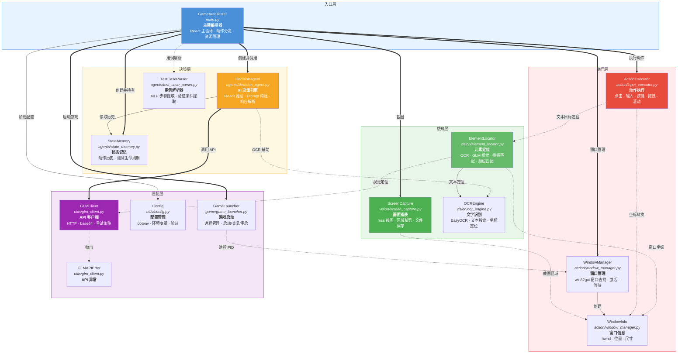
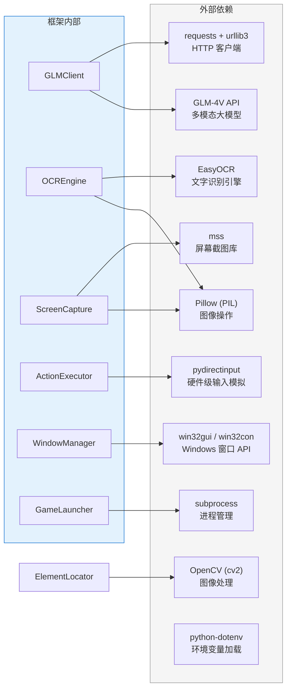

# 组件图

## 分层组件架构

按职责将系统划分为 5 个层次的 Mermaid 组件图，展示模块间的调用关系和数据流向。

## 图例说明

| 线型 | 含义 |
|------|------|
| `==>` 实线粗箭头 | 直接调用（创建、持有、主流程调用） |
| `-->` 实线细箭头 | 依赖注入（构造函数注入） |
| `-.->` 虚线箭头 | 运行时依赖（方法参数注入、可选依赖、间接使用） |

## 层间调用规则

| 调用方 | 被调用方 | 调用方式 |
|--------|----------|----------|
| 入口层 -> 决策层 | `GameAutoTester` -> `DecisionAgent` | 创建并调用 `decide()` |
| 入口层 -> 感知层 | `GameAutoTester` -> `ScreenCapture` | 创建并调用 `capture()` |
| 入口层 -> 执行层 | `GameAutoTester` -> `ActionExecutor` | 创建并调用动作方法 |
| 入口层 -> 适配层 | `GameAutoTester` -> `GameLauncher` / `Config` / `GLMClient` | 创建并管理生命周期 |
| 决策层 -> 适配层 | `DecisionAgent` -> `GLMClient` | 依赖注入，调用 `chat_with_image()` |
| 决策层 -> 感知层 | `DecisionAgent` -> `OCREngine` | 运行时注入，用于画面描述 |
| 感知层 -> 适配层 | `ElementLocator` -> `GLMClient` | 依赖注入，用于视觉定位 |
| 感知层 -> 感知层 | `ElementLocator` -> `OCREngine` | 依赖注入，用于文本定位 |
| 执行层 -> 感知层 | `ActionExecutor` -> `ElementLocator` | 方法参数注入，用于目标定位 |

## 外部依赖封装

