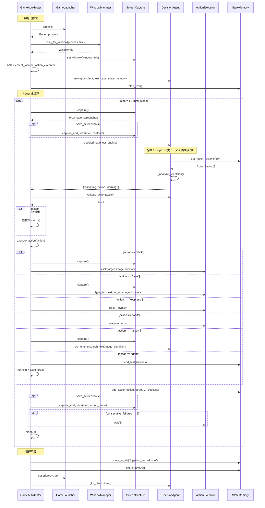
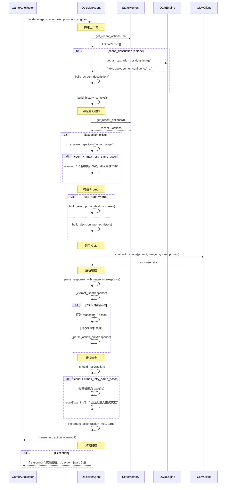
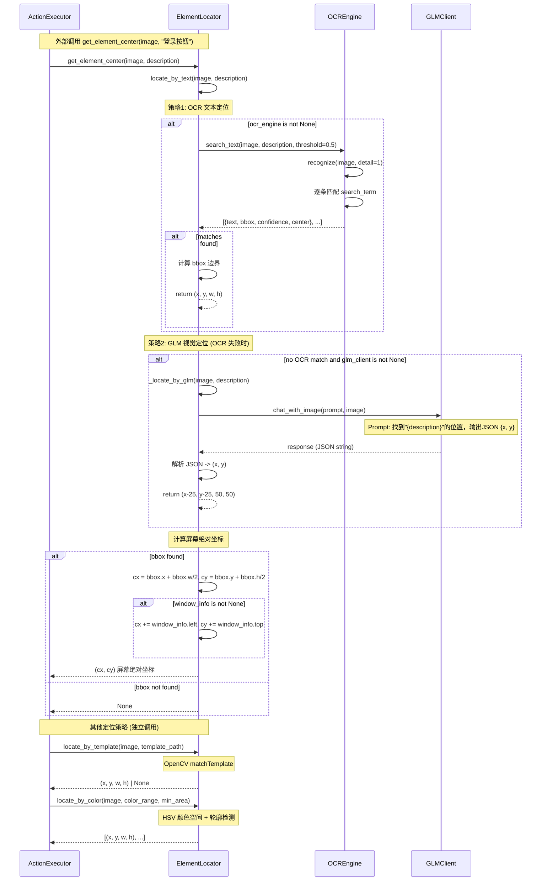
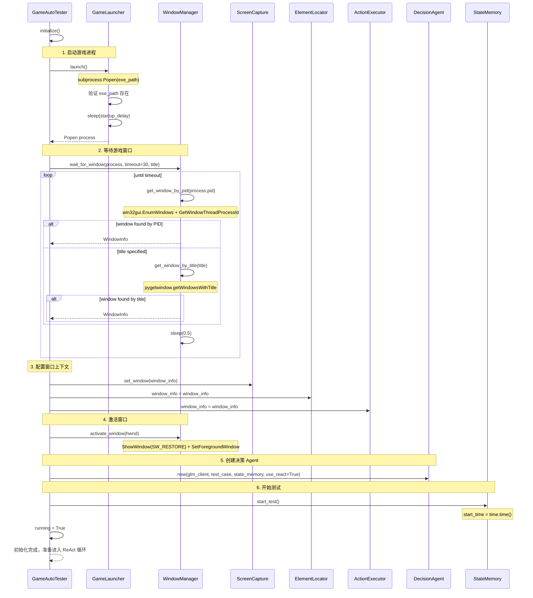
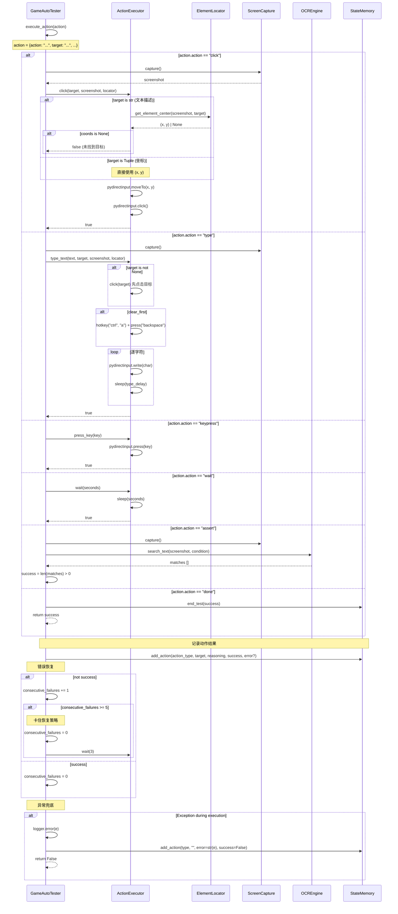

# 时序图

## 1. ReAct 主循环

`GameAutoTester.run()` 的完整生命周期：初始化 -> 循环（观察-推理-行动）-> 清理。

---

## 2. DecisionAgent.decide() 决策流程

`DecisionAgent.decide()` 内部的 ReAct 推理全过程。

---

## 3. ElementLocator 元素定位

`ElementLocator` 的多策略定位链：OCR 文本 -> GLM 视觉 -> 模板匹配 -> 颜色匹配。

---

## 4. 游戏启动初始化

`GameAutoTester.initialize()` 的完整启动流程。

---

## 5. 动作执行与错误恢复

`GameAutoTester.execute_action()` 的动作分发和连续失败恢复机制。

